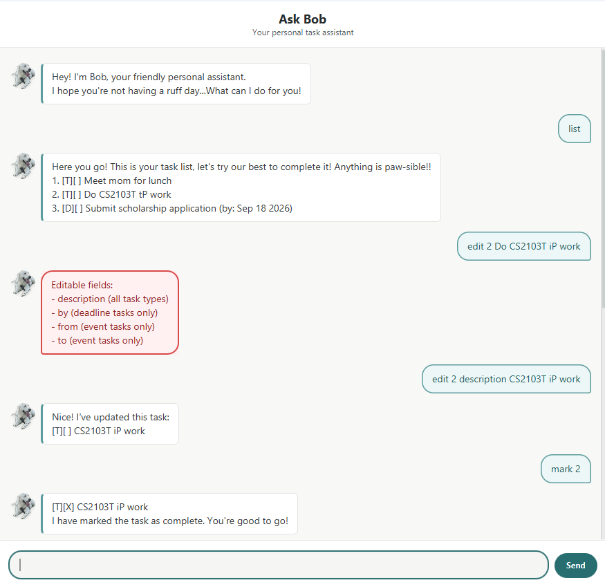

# Bob User Guide

Bob is a **friendly desktop task assistant that helps you keep track of to-dos,
deadlines, and events using short text commands.** Your tasks are saved
automatically, so they will still be available the next time Bob starts. 🐾



## Quick start

1. Ensure that Java 25 or later is installed on your computer.
2. Download `bob.jar` from the
   [latest Bob release](https://github.com/sammeowwww/ip/releases).
3. Move `bob.jar` into the folder where you want Bob to store its data.
4. Open a terminal in that folder and run:

   ```shell
   java -jar bob.jar
   ```

5. Enter a command in the message box and press **Enter**, or select **Send**.

> **Tip:** Enter `help` at any time to see Bob's supported command formats.

## Command notation

When **typing in commands** to the task assistant, be mindful of the following pointers:

- Words in `UPPER_CASE` are parameters that you need to replace.
- Task numbers correspond to the numbers displayed by `list` and start from 1.
- Dates must use the `yyyy-MM-dd` format, such as `2026-09-20`.
- Do not type the angle brackets shown in command formats.

For example, enter `todo read book`, not `todo <DESCRIPTION>`.

Task symbols have the following meanings:

| Symbol | Meaning |
| --- | --- |
| `[T]` | To-do |
| `[D]` | Deadline |
| `[E]` | Event |
| `[ ]` | Incomplete |
| `[X]` | Complete |

## Features

Bob supports four core task-management operations:

1. Adding a task
2. Deleting a task
3. Editing a task
4. Marking a task as complete or incomplete

There are three types of tasks that can be added:

- To-do (a task without any date attached)
- Deadline (a task with a deadline)
- Event (a task that has a **start** and **end** date)

### Command summary

The table below lists the available actions.
Select an action to jump to its
detailed instructions.

| Action | Format |
| --- | --- |
| [Show help](#viewing-help-help) | `help` |
| [Add a to-do](#adding-a-to-do-todo) | `todo DESCRIPTION` |
| [Add a deadline](#adding-a-deadline-deadline) | `deadline DESCRIPTION /by DATE` |
| [Add an event](#adding-an-event-event) | `event DESCRIPTION /from START_DATE /to END_DATE` |
| [List tasks](#listing-tasks-list) | `list` |
| [Mark complete](#marking-a-task-as-complete-mark) | `mark TASK_NUMBER` |
| [Mark incomplete](#marking-a-task-as-incomplete-unmark) | `unmark TASK_NUMBER` |
| [Delete a task](#deleting-a-task-delete) | `delete TASK_NUMBER` |
| [Find tasks](#finding-tasks-find) | `find KEYWORD` |
| [Edit a task](#editing-a-task-edit) | `edit TASK_NUMBER FIELD NEW_VALUE` |
| [Say goodbye](#saying-goodbye-bye) | `bye` |

### Viewing help: `help`

Shows all commands supported by Bob.

```text
help
```

### Adding a to-do: `todo`

Adds a task without a date.

Format: `todo DESCRIPTION`

Example:

```text
todo read book
```

Bob adds and displays `[T][ ] read book`.

### Adding a deadline: `deadline`

Adds a task that must be completed by a specific date.

Format: `deadline DESCRIPTION /by DATE`

Example:

```text
deadline return book /by 2026-09-20
```

Bob displays the date in a friendlier form, such as
`[D][ ] return book (by: Sep 20 2026)`.

### Adding an event: `event`

Adds a task that takes place between two dates.

Format: `event DESCRIPTION /from START_DATE /to END_DATE`

Example:

```text
event project meeting /from 2026-09-20 /to 2026-09-21
```

### Listing tasks: `list`

Shows every saved task and its current number.

```text
list
```

Example output:

```text
1. [T][ ] read book
2. [D][X] return book (by: Sep 20 2026)
```

### Marking a task as complete: `mark`

Changes the selected task's status to `[X]`.

Format: `mark TASK_NUMBER`

Example:

```text
mark 2
```

### Marking a task as incomplete: `unmark`

Changes the selected task's status back to `[ ]`.

Format: `unmark TASK_NUMBER`

Example:

```text
unmark 2
```

### Deleting a task: `delete`

Permanently removes the selected task from the task list.

Format: `delete TASK_NUMBER`

Example:

```text
delete 1
```

> **Important:** Task numbers can change after a deletion. Use `list` before
> your next numbered command if you are unsure.

### Finding tasks: `find`

Shows tasks whose descriptions contain the keyword. Matching is
case-insensitive; dates are not searched.

Format: `find KEYWORD`

Example:

```text
find book
```

### Editing a task: `edit`

Changes one field without deleting and recreating the task. All other task
details and its completion status are preserved.

Format: `edit TASK_NUMBER FIELD NEW_VALUE`

| Field | Valid task types | Example |
| --- | --- | --- |
| `description` | All tasks | `edit 1 description read two books` |
| `by` | Deadline only | `edit 2 by 2026-09-25` |
| `from` | Event only | `edit 3 from 2026-10-01` |
| `to` | Event only | `edit 3 to 2026-10-02` |

### Saying goodbye: `bye`

Shows Bob's farewell message. In the command-line version, it also ends the
session. The desktop window can be closed normally using its window controls.

```text
bye
```

## Saving data

Bob saves the task list automatically whenever you add, edit, mark, unmark, or
delete a task. Data is stored in `data/bob.txt`, relative to the folder from
which Bob was started. You do not need to save manually.

Avoid editing the data file while Bob is running, as malformed data may prevent
existing tasks from loading the next time Bob starts.
